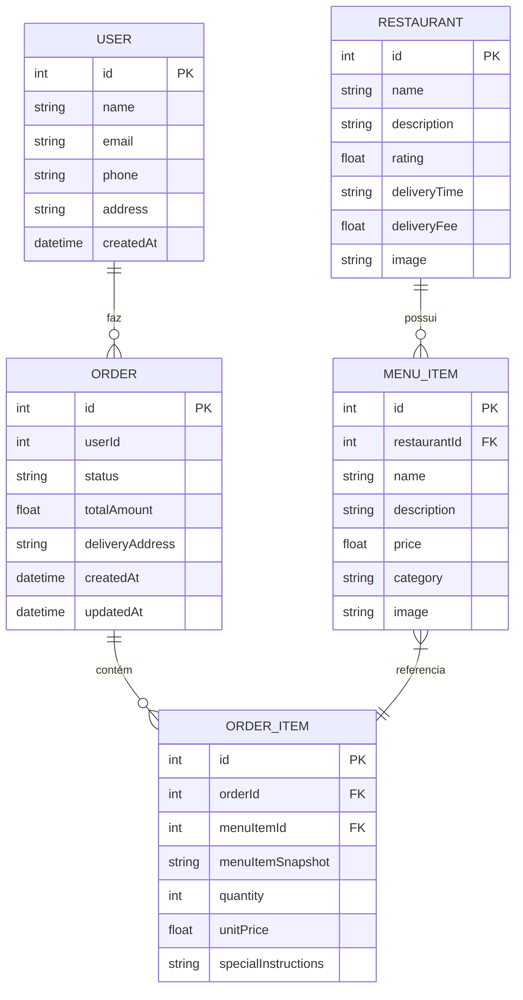

# Diagrama Entidade-Relacionamento (ERD) do Mandaí

## Visão Geral

Este documento apresenta o diagrama entidade-relacionamento (ERD) do aplicativo Mandaí, especificando as entidades principais, seus atributos e relacionamentos. O modelo foi projetado para suportar o fluxo completo de pedidos de delivery, desde a exploração de restaurantes até a finalização de pedidos.

## Diagrama ERD em Mermaid

## Explicação das Decisões de Modelagem

### Snapshots em OrderItem
Uma decisão importante foi incluir um campo `menuItemSnapshot` em `ORDER_ITEM`. Isso permite armazenar uma cópia completa dos detalhes do item no momento em que o pedido foi feito. Essa abordagem é crucial porque:

1. Preços podem mudar após o pedido ser criado
2. Itens podem ser removidos do cardápio
3. Descrições podem ser atualizadas
4. É essencial manter a integridade dos dados do pedido para histórico e auditoria

### Estrutura de Status
O campo `status` em `ORDER` permite controlar o fluxo completo do pedido:
- `pending`: Pedido criado mas não confirmado
- `confirmed`: Pedido confirmado pelo restaurante
- `preparing`: Pedido em preparação
- `ready`: Pedido pronto para retirada/entrega
- `in_transit`: Pedido em rota de entrega
- `delivered`: Pedido entregue com sucesso
- `cancelled`: Pedido cancelado

### Taxas e Totais
Ao invés de calcular taxas dinamicamente, optamos por armazenar valores concretos (`totalAmount`) no pedido. Isso garante que mesmo que as políticas de entrega mudem futuramente, os registros históricos permaneçam precisos.

### Extensibilidade
O modelo foi projetado para extensões futuras:
- Avaliações podem ser adicionadas com uma entidade `REVIEW`
- Categorias de restaurantes com uma entidade `CATEGORY`
- Cupons/promoções com uma entidade `PROMOTION`
- Pagamentos com uma entidade `PAYMENT`

Esta estrutura fornece uma base sólida para o aplicativo Mandaí enquanto mantém flexibilidade para evolução futura.